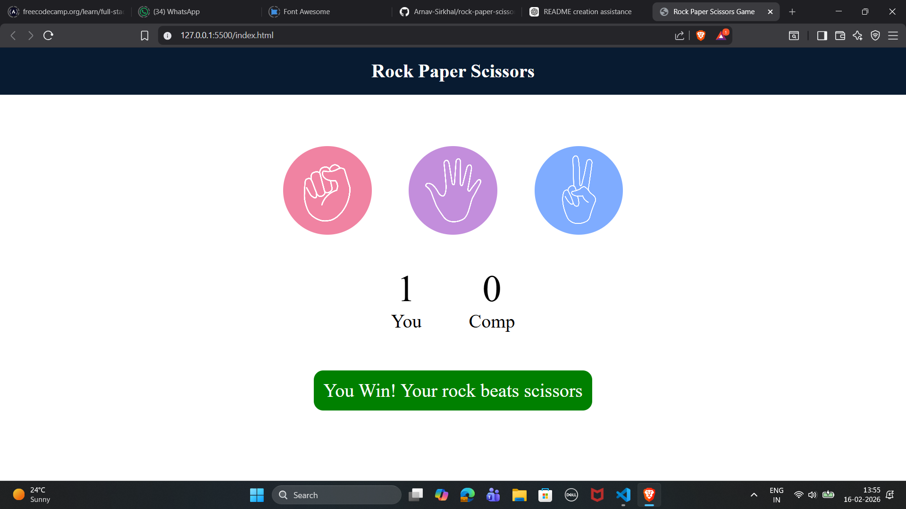
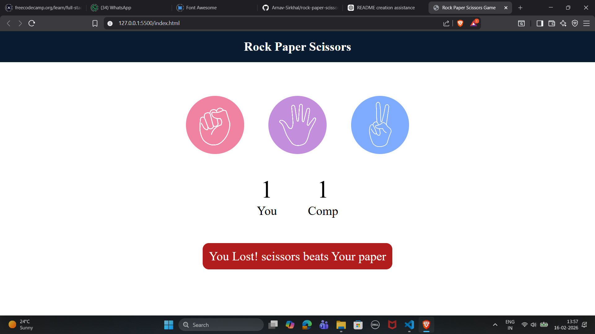
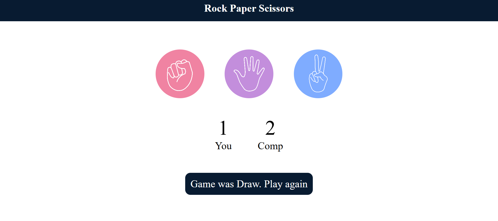

# 🪨📄✂️ Rock Paper Scissors Game

An interactive **Rock Paper Scissors game** built using **HTML, CSS, and JavaScript**, featuring **live score tracking**, **dynamic result messages**, and **color-coded feedback**.

The game allows users to play against the computer, which makes random choices. Scores update instantly, and result messages clearly indicate whether the player wins, loses, or draws.

---

## 📑 Table of Contents

- [About the Project](#about-the-project)
- [Live Demo](#-live-demo)
- [Screenshots](#screenshots)
- [Features](#features)
- [Game Logic](#game-logic)
- [Live Score Tracking](#live-score-tracking)
- [Result Message System](#result-message-system)
- [Technologies Used](#technologies-used)
- [Project Structure](#project-structure)
- [How to Run the Project](#how-to-run-the-project)
- [Author](#author)

---

## 📖 About the Project

This is a browser-based implementation of the classic **Rock Paper Scissors game** where:

- The user selects Rock, Paper, or Scissors
- The computer generates a random choice
- The winner is decided instantly
- Scores are updated live
- Messages show results with color feedback

---

## 🌐 Live Demo

Play the game here:
👉 https://arnav-sirkhal.github.io/rock-paper-scissor-html-css-js/

---

## 📸 Screenshots

### 🟢 Winning Message



### 🔴 Losing Message



### 🔵 Draw Message



## ✨ Features

---

- 🎮 Play against computer
- 📊 Live score tracking
- 🎯 Random computer choice generation
- 🟢 Green message when player wins
- 🔴 Red message when player loses
- 🔵 Dark blue message when game is draw
- ⚡ Instant result display
- 🖱️ Click-based interaction
- 🧠 Clean and simple game logic

---

## ⚙️ Game Logic

Game logic is handled using JavaScript functions.

### Computer Choice Generation

```javascript
const genCompChoice = () => {
  const options = ["rock", "paper", "scissors"];
  const randIdx = Math.floor(Math.random() * 3);
  return options[randIdx];
};
```

This function randomly selects one of the three options.

---

### Draw Condition

If both user and computer choose the same option:

```javascript
if (userChoice === compChoice) {
  drawGame();
}
```

---

### Winner Determination Example

```javascript
if (userChoice === "rock") {
  userWin = compChoice === "paper" ? false : true;
}
```

---

## 📊 Live Score Tracking

Scores are stored in variables:

```javascript
let userScore = 0;
let compScore = 0;
```

Scores update dynamically on screen:

```javascript
userScore++;
userScorePara.innerText = userScore;
```

```javascript
compScore++;
compScorePara.innerText = compScore;
```

---

## 💬 Result Message System

Messages update dynamically based on result.

### Win Message

```javascript
msg.innerText = `You Win! Your ${userChoice} beats ${compChoice}`;
msg.style.backgroundColor = "green";
```

### Lose Message

```javascript
msg.innerText = `You Lost! ${compChoice} beats Your ${userChoice}`;
msg.style.backgroundColor = "#b11c1c";
```

### Draw Message

```javascript
msg.innerText = "Game was Draw. Play again";
msg.style.backgroundColor = "#081b31";
```

---

## 🛠️ Technologies Used

- HTML5
- CSS3
- JavaScript (Vanilla JS)
- DOM Manipulation
- Event Listeners

---

## 📁 Project Structure

```
rock-paper-scissors-game/
│
├── index.html
├── style.css
├── script.js
├── images/
│   ├── rock.png
│   ├── paper.png
│   ├── scissors.png
│   ├── win-message.png
│   ├── lose-message.png
│   └── draw-message.png
│
├── LICENSE
└── README.md
```

---

## ▶️ How to Run the Project

### Step 1: Clone the repository

```bash
git clone https://github.com/your-username/rock-paper-scissors-game.git
```

### Step 2: Open folder

```bash
cd rock-paper-scissors-game
```

### Step 3: Open in browser

Open `index.html` in your browser.

---

## 🧠 Code Explanation

### Event Listener

```javascript
choices.forEach((choice) => {
  choice.addEventListener("click", () => {
    const userChoice = choice.getAttribute("id");
    playGame(userChoice);
  });
});
```

This detects user clicks and starts the game.

---

### Main Game Function

```javascript
const playGame = (userChoice) => {
  const compChoice = genCompChoice();

  if (userChoice === compChoice) {
    drawGame();
  } else {
    showWinner(userWin, userChoice, compChoice);
  }
};
```

Controls the main game flow.

---

## 🎨 Color Reference

| Result | Color     | Code    |
| ------ | --------- | ------- |
| Win    | Green     | green   |
| Lose   | Red       | #b11c1c |
| Draw   | Dark Blue | #081b31 |

---

## 👤 Author

**Arnav Sirkhal**

GitHub: https://github.com/Arnav-Sirkhal

---
